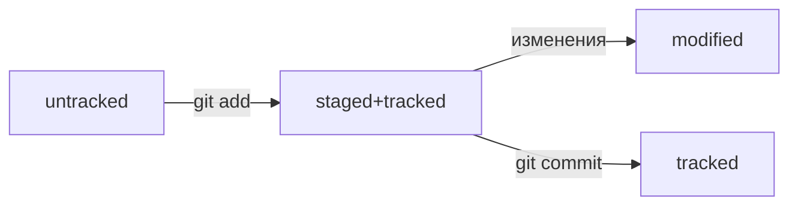

# Яндекс Практикум  
## Изучение Git
---
```bash
$pwd
```
```bash
$cd
```
```bash
$ls
```
```bash
$touch
```
```bash
$mkdir
```
```bash
$cp
```
```bash
$mv
```
```bash
$cat
```
```bash
$rm
```
```bash
$rmdir
```
```bash
$git version
```
```bash
$git config
```
```bash
$git init
```
```bash
$rm -rf .git
```
```bash
$git status
```
```bash
$git add .
```
```bash
$git commit -m 'message'
```

```bash
$git log
```

## Схема статусов


